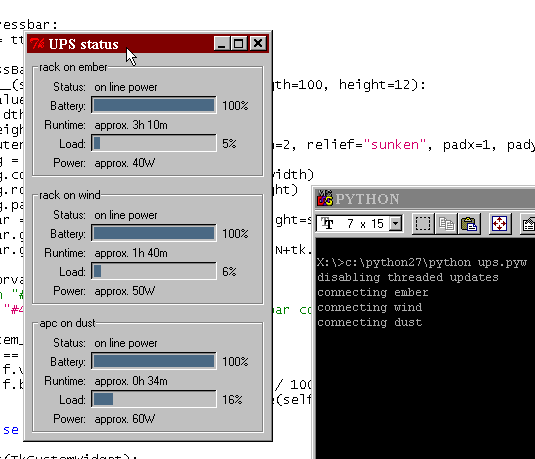
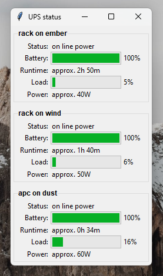

upsmonitor-tk
=============

upsmonitor is a small Python/Tk-based client for remote UPS status monitoring via NUT or apcupsd.

It requires Python 2.5 or later, and has been tested on Linux and Windows 98/XP/11.

Usage
-----

List your UPS in `.ups.conf` (either in your home directory, or in the program location), with optional descriptions:

    apc@foo       HostFoo UPS
    rack@bar
    @quux         apcupsd service on quux
